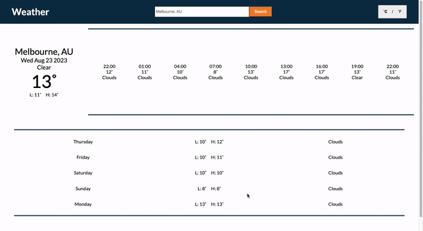

# Weather App
A simple weather app using the WeatherAPI for forecast data built with HTML and Javascript.

Live Demo: https://stickmanj0e.github.io/weather-app/

## Features
- Search a location for forecast data.

- Display daily or hourly forecast data for a given location.
- A celcius/fahrenheit toggle.

